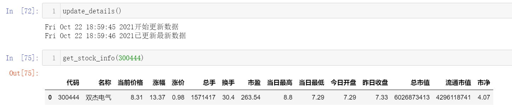
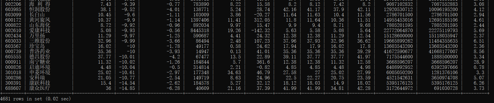
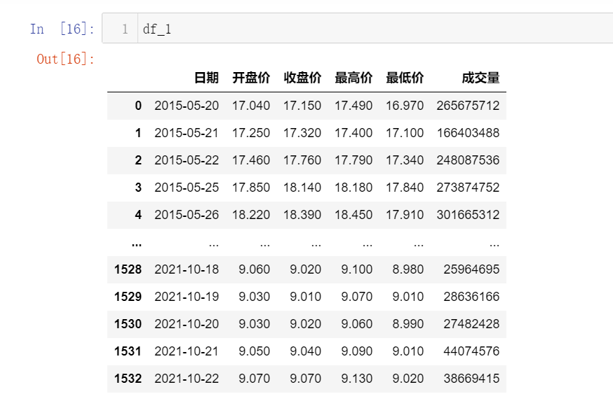
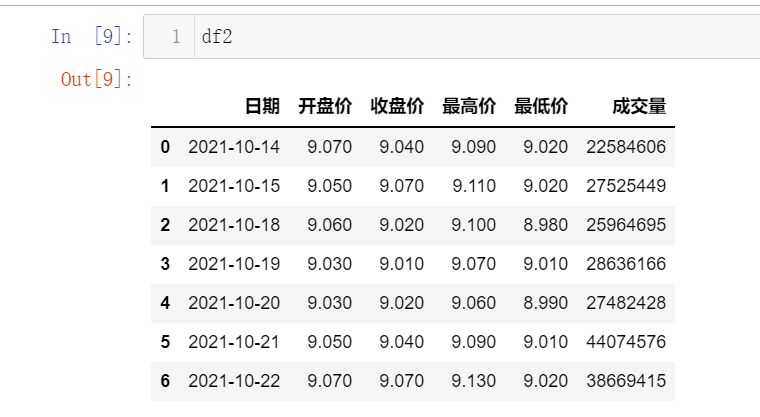
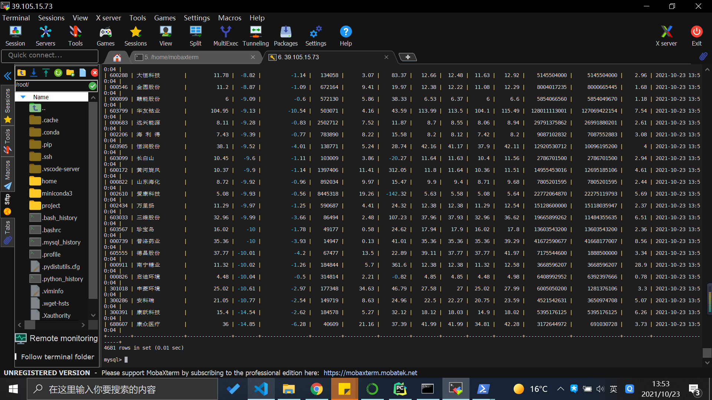

### 10.22

---------------

完成设计文档，爬取实时股票行情数据并存入数据库中；完成数据库更新函数update_details()和指定代码股票查询接口get_stock_info()

完成历史数据的爬取，并根据股票代码和需求做好了两个接口：

> 1. 获取某段时间内的全部股票信息 get_interval_data
> 2. 获取近N天内的全部股票信息 get_ndays_data

### 10.23

------------

完成了服务器的部署，将实时数据部署在服务器上并存入服务器上的数据库中，每隔30min进行一次更新。考虑到开盘时间固定，明天打算修改一下crontab里的设置，节约一些必要的资源...

### 10.24

-------

修改了定时任务的执行时间，根据股市开盘时间调整为周一至周五9:00-12:00/13:00-15:00执行（取整，暂未考虑节假日和调休），测试阶段为节约资源每30min运行一次，可根据需求修改。

完成了k线均线及成交量柱状图的绘制，封装好接口并整理好jupyter notebook版本，方便进行数据分析。

做了一个静态网页框架（还没做完），可以展示当天的大盘和高开低走的所有股票信息，还有两个板块考虑放一下其它有价值的数据图。

### 10.25

--------

将网页程序拿到服务器上部署运行，从服务器的数据库中获取数据，目前运行开发模式，host ip设置为0.0.0.0，使本地可以直接访问。

补充右边两个模块为当前涨停股票列表/跌停股票列表，并添加显示涨跌停股票支数显示，该数据可以实时更新，若需要更新大盘数据则需刷新网页（不过数据库目前都是30min更一次，刷新几乎没啥意义> <），使用CSS渲染网页。至此项目基本完成，可以根据需求进行功能的添加和优化。

